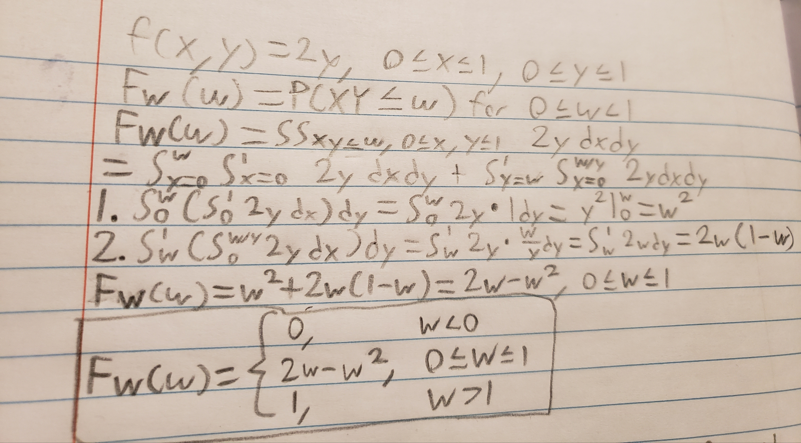
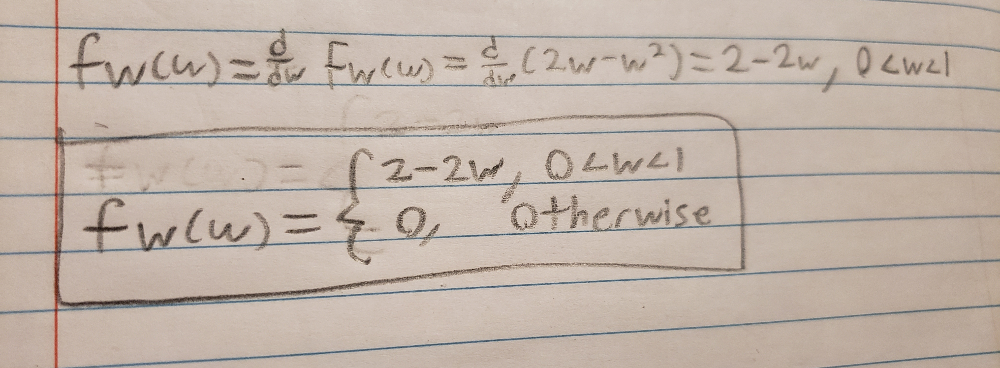

```{r setup, include=FALSE}
knitr::opts_chunk$set(echo = TRUE)
```


1 and 2.

```{R}





```


3 and 4.

```{R}
fW <- function(w) ifelse(w >= 0 & w <= 1, 2 * (1 - w), 0)
FW <- function(w) ifelse(w < 0, 0,
                  ifelse(w <= 1, 2 * w - w^2, 1))

w <- seq(-0.2, 1.2, length = 400)

plot(w, fW(w), type = "l", lwd = 2, col = "blue",
     main = "PDF of W = XY",
     xlab = "w", ylab = "f_W(w)")
abline(h = 0, lty = 2)

plot(w, FW(w), type = "l", lwd = 2, col = "red",
     main = "CDF of W = XY",
     xlab = "w", ylab = "F_W(w)")
abline(h = c(0, 1), lty = 2)
```
