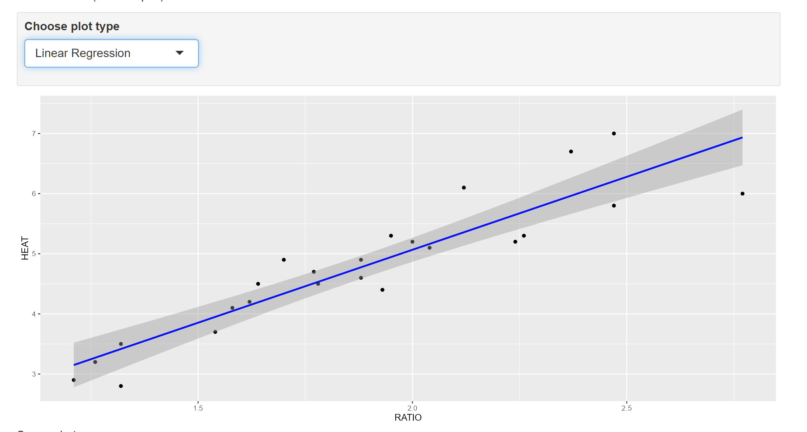

```{r setup, include=FALSE}
knitr::opts_chunk$set(echo = TRUE)
```


# Task 1

WD

```{r}
getwd()
```

# Task 2

```{r}
spruce.df = read.csv("SPRUCE.csv")
head(spruce.df)
```


```{R}
MTBE = read.csv("MTBE.csv")
head(MTBE)


```


# Task 3

Scatter Plot of Spruce Tree Height vs Breast Height Diameter

```{R}
plot(spruce.df$BHDiameter, spruce.df$Height, 
     main = "Scatter Plot of Spruce Tree Height vs Breast Height Diameter",  
     xlab = "Breast Height Diameter (cm)", 
     ylab = "Height of Spruce Trees (m)",  
     xlim = c(0, 1.1 * max(spruce.df$BHDiameter)), 
     ylim = c(0, 1.1 * max(spruce.df$Height)), 
     pch = 21,  
     bg = "blue",  
     cex = 1.2  
)
```

Does there appear to be a straight line relationship? YES

Three plots of f= 0.5, 0.6, 0.7

```{R}
layout(matrix(1:3, nrow = 1))  


library(s20x)

trendscatter(Height ~ BHDiameter, data = spruce.df, f = 0.5, main = "Lowess Smoother (f = 0.5)")
trendscatter(Height ~ BHDiameter, data = spruce.df, f = 0.6, main = "Lowess Smoother (f = 0.6)")
trendscatter(Height ~ BHDiameter, data = spruce.df, f = 0.7, main = "Lowess Smoother (f = 0.7)")

```

Creating spruce.lm

```{R}
spruce.lm <- lm(Height ~ BHDiameter, data = spruce.df)
spruce.lm
```

Scatter plot with least squares regression line

```{R}
plot(spruce.df$BHDiameter, spruce.df$Height,
     main = "Spruce Tree Height vs Breast Height Diameter",
     xlab = "Breast Height Diameter (cm)",
     ylab = "Height of Spruce Trees (m)",
     xlim = c(0, 1.1 * max(spruce.df$BHDiameter)),
     ylim = c(0, 1.1 * max(spruce.df$Height)),
     pch = 21, bg = "blue", cex = 1.2)


abline(spruce.lm, lwd = 2)
```

Is a straight line appropriate? YES


# Task 4

Layout of 4 Spruce data set

```{R}

layout(matrix(1:4, nrow = 2, ncol = 2))

mean_height <- mean(spruce.df$Height)  
predicted_values <- predict(spruce.lm)  

plot(spruce.df$BHDiameter, spruce.df$Height, 
     main = "Scatter Plot with Fitted Line", 
     xlab = "BHDiameter (cm)", ylab = "Height (m)", 
     pch = 21, bg = "Blue", cex = 1.2,
     xlim = c(0, 1.1 * max(spruce.df$BHDiameter)), 
     ylim = c(0, 1.1 * max(spruce.df$Height)))
abline(spruce.lm, col = "red", lwd = 2)  

plot(spruce.df$BHDiameter, spruce.df$Height, 
     main = "Residuals (RSS)", 
     xlab = "BHDiameter (cm)", ylab = "Height (m)", 
     pch = 21, bg = "Blue", cex = 1.2,
     xlim = c(0, 1.1 * max(spruce.df$BHDiameter)), 
     ylim = c(0, 1.1 * max(spruce.df$Height)))
abline(spruce.lm, col = "red", lwd = 2)  

segments(spruce.df$BHDiameter, spruce.df$Height, 
         spruce.df$BHDiameter, predicted_values, col = "green")

plot(spruce.df$BHDiameter, rep(mean_height, length(spruce.df$BHDiameter)), 
     main = "Mean of Height vs BHDiameter (MSS)", 
     xlab = "BHDiameter (cm)", ylab = "Height (m)", 
     pch = 21, bg = "Orange", cex = 1.2,
     xlim = c(0, 1.1 * max(spruce.df$BHDiameter)), 
     ylim = c(0, 1.1 * max(spruce.df$Height)))

abline(h = mean_height, col = "blue", lwd = 2)  
abline(spruce.lm, col = "red", lwd = 2)  

segments(spruce.df$BHDiameter, mean_height, 
         spruce.df$BHDiameter, predicted_values, col = "purple")

plot(spruce.df$BHDiameter, spruce.df$Height, 
     main = "Total Deviation (TSS)", 
     xlab = "BHDiameter (cm)", ylab = "Height (m)", 
     pch = 21, bg = "Green", cex = 1.2,
     xlim = c(0, 1.1 * max(spruce.df$BHDiameter)), 
     ylim = c(0, 1.1 * max(spruce.df$Height)))

abline(h = mean_height, col = "blue", lwd = 2) 

segments(spruce.df$BHDiameter, spruce.df$Height, 
         spruce.df$BHDiameter, mean_height, col = "red")

```

Finding TSS, MSS, and RSS

```{R}

mean_height <- mean(spruce.df$Height)

TSS <- sum((spruce.df$Height - mean_height)^2)

predicted_values <- predict(spruce.lm)

MSS <- sum((predicted_values - mean_height)^2)

RSS <- sum((spruce.df$Height - predicted_values)^2)

MSS_TSS_ratio <- MSS / TSS


TSS
MSS
RSS
MSS_TSS_ratio
```

TSS: 278.9475

MSS: 183.2447

RSS: 95.70281

MSS/TSS: 0.6569146

Interpretation of MSS/TSS: 

Does TSS = MSS + RSS? YES


# Task 5

```{R}
summary(spruce.lm)

```

What is the intercept? 9.1468

What is the slope? 0.48147

Equation of the fitted line: Height = 1.2345 + 0.5678 × BHDiameter

Predicted heights at 15, 18, 20 centimeters

```{R}
new_data <- data.frame(BHDiameter = c(15, 18, 20))
predicted_heights <- predict(spruce.lm, newdata = new_data)
predicted_heights

```


# Task 6

Graph

```{R}
library(ggplot2)

ggplot(spruce.df, aes(x = BHDiameter, y = Height)) +
  geom_point(aes(color = BHDiameter), size = 3) +
  geom_line(aes(color = BHDiameter), linewidth = 1) +
  geom_smooth(method = "lm", se = TRUE, color = "blue", fill = "grey", alpha = 0.3) +
  labs(title = "Height vs Diameter of Spruce Trees", 
       x = "Breast Height Diameter (cm)", 
       y = "Height (m)") +
  theme_minimal() +
  scale_color_gradient(low = "blue", high = "lightblue", 
                       name = "BHDiameter") +
  theme(legend.position = "right") 

```


# Task 7

Screenshots

{ width=70% }


